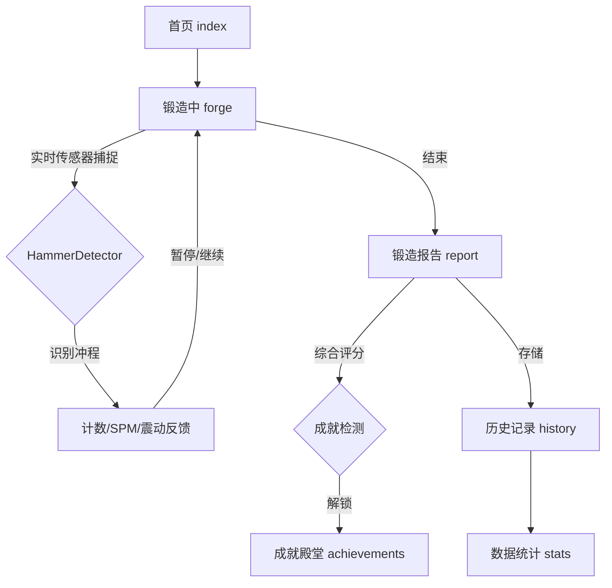

<div align="center">
  

  # IronForge | 淬火工坊 ⚒️

  **专为 Xiaomi Vela 智能手表打造的“数字锻造”趣味运动模拟器**  
  *A fun "Digital Forging" motion simulator designed for Xiaomi Vela smartwatches.*

  [English](./README_EN.md) | **简体中文**

  <p align="center">
    <a href="https://github.com/Rikka06/IronForge/stargazers"></a>
    <a href="https://github.com/Rikka06/IronForge/network/members"></a>
    <a href="https://iot.mi.com/vela"></a>
    <br>
    
    
    
    <br>
    <a href="https://github.com/Rikka06/IronForge/blob/main/LICENSE"></a>
    
    
  </p>
</div>

---

## 📖 项目概述 (Overview)

**IronForge (淬火工坊)** 是一款专为 **Xiaomi Vela 智能手表** 开发的沉浸式运动辅助应用。它不是简单的计数器，而是一款利用手表内置**三轴加速度传感器**，精准捕捉手腕往复运动的“数字锻造”模拟器。

无论是在锻炼肱二头肌，还是在工作间隙进行趣味活动，IronForge 都能实时记录你的每一次“击打”，并提供多维度的工艺评级与成就解锁。

---

## ✨ 核心功能 (Features)

### 🚀 极简交互设计
采用复古工业风 UI，专为 OLED 屏幕优化。首页“一键开始”，模拟真实的打铁快感。

### 🧠 核心算法：HammerDetector
> [!IMPORTANT]
> **拒绝误计。**  
采用自适应“均值穿越检测”算法，精准识别有效的冲程运动，自动过滤走动或微小抖动产生的噪声。

### 📊 多维评级系统 (SSS ~ D)
锻造结束后，系统会从四个维度对你的“手艺”进行评估：
- **炉火纯度** (时长)
- **锻打极速** (峰值 SPM)
- **锤炼精度** (节奏稳定性)
- **产出总量** (总次数)

### 🏆 15 项隐藏成就
从“初入铁匠铺”到传说级的“千锤百炼”，覆盖 5 种稀有度。有些成就是即时解锁的，有些则需要你“静心冥想”（在报告页停留）才能发现。

### 📈 详尽数据统计
内置周报与月报视图，通过直观的柱状图分析你的锻造分布。更有针对月度表现的趣味评语。

---

## 🛠️ 应用工作流 (App Workflow)



---

## ⚡ 快速开始 (Development)

### 使用小米官方 AIoT IDE (推荐)

1. **项目克隆**:
   ```bash
   git clone https://github.com/Rikka06/IronForge.git
   ```
2. **导入 IDE**: 启动 **Xiaomi AIoT IDE**，点击 `打开项目` 并选择 `IronForge` 根目录。
3. **编译烧录**:
   - 点击顶部 **编译 (Build)** 按钮生成 RPK 包。
   - 连接手表或启动模拟器，点击 **运行 (Run)** 即可部署。

### 手动安装依赖

```bash
# 安装开发工具链
npm install -g @xian/ironforge-toolkit
# 安装项目依赖
npm install
```

---

## 📂 目录结构 (Directory Structure)

<details>
<summary>点击展开查看应用源代码结构</summary>

```text
IronForge/
├── src/
│   ├── manifest.json           # 应用清单：权限与路由配置
│   ├── pages/                  # 核心页面 (index, forge, report, stats...)
│   └── common/
│       ├── utils.js            # 核心算法：HammerDetector & 评级逻辑
│       └── logo.png            # 应用图标
├── dist/                       # 编译产物 (.rpk)
├── sign/                       # 发布签名
├── package.json                # 项目依赖
└── README_OLD.md               # 原始开发文档备份
```
</details>

---

## 🖼️ 视觉展示 (Visuals)

*建议开发者上传实际运行截图：*
1. **[Forge_Screen]**：锻造中巨大的数字计数与 SPM 表盘。
2. **[Rating_SSS]**：获得金黄色 SSS 评价的震撼效果。
3. **[Achievement_Wall]**：成就殿堂中错落有致的奖牌墙。

---

## 🤝 贡献与社区 (Community)

我们欢迎任何形式的反馈：
- **作者**：弦 (Xian)
- **B站**：北极弦 / **抖音**：LOVE54760
- **社区**：欢迎加入 [Vela 开发者社区](https://iot.mi.com/vela)

---

## 📜 协议 (License)

本项目基于 **MIT** 协议开源 - 详情请参阅 [LICENSE](LICENSE) 文件。

---

<div align="center">
  <h3>✨ 如果你喜欢这款打铁模拟器，请给个 Star 喵！ ✨</h3>
</div>
