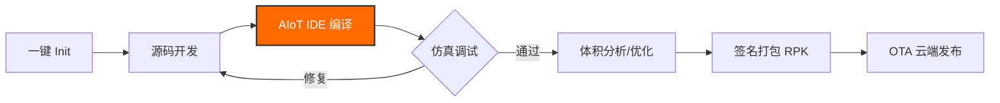

<div align="center">
  

  # IronForge | 淬火工坊 🛠️

  **小米 Vela AIoT 操作系统专用的高效开发锻造工具链**  
  *The high-performance development and forging toolchain for Xiaomi Vela AIoT OS.*

  [English](./README_EN.md) | **简体中文**

  <p align="center">
    <a href="https://github.com/Rikka06/IronForge/stargazers"></a>
    <a href="https://github.com/Rikka06/IronForge/network/members"></a>
    <a href="https://iot.mi.com/vela"></a>
    <br>
    
    
    
    <br>
    <a href="https://github.com/Rikka06/IronForge/blob/main/LICENSE"></a>
    
    
  </p>
</div>

---

## 📖 项目概述 (Overview)

**IronForge (淬火工坊)** 是由 **弦 (Xian)** 组织精心打造的专业工程化套件。我们深知穿戴设备开发中包体积限制、环境差异大、调试链路长等痛点。IronForge 通过深度集成小米官方 **AIoT IDE**，为开发者提供从初始化到云端 OTA 的全生命周期加速，助力每一款 Vela 应用都能练就“百炼成钢”的极致品质。

---

## ✨ 核心特性 (Features)

### 🚀 极简一键初始化
秒级生成基于最佳实践的 Vela 工程模板，内置代码规范与项目结构，告别手动配置的繁琐。

### 🏗️ 官方 AIoT IDE 深度集成
开发者无需关心复杂的底层编译指令。在 **小米 AIoT IDE** 中一键点击，即可完成 RPK 日志抓取、断点调试与固件构建。

### 📊 像素级体积分析
> [!TIP]
> **穿戴设备每一 KB 空间都弥足珍贵。**  
IronForge 提供颗粒度到文件的体积可视化工具，直观定位冗余依赖，支持针对 Vela 运行时的资源深度压缩。

### 💻 增强型本地仿真
模拟真实手表的触摸交互、传感器数值输入（加速度、心率等）与异常逻辑断点，在真机上手前解决 99% 的交互漏洞。

### 📦 工业级打包流水线
全自动化的 **签名 → 打包 → 校验 → 固件生成** 流程。内置 OTA 差异包对比算法，确保更小、更快的云端分发。

---

## 🛠️ 工作流演示 (Workflow)



---

## ⚡ 快速上手 (Quick Start)

### 使用小米官方 AIoT IDE (推荐)

1. **克隆项目**:
   ```bash
   git clone https://github.com/Rikka06/IronForge.git
   ```
2. **导入 IDE**: 启动 **Xiaomi AIoT IDE**，选择 `打开项目` 并指向 `IronForge` 根目录。
3. **一键构建**: 点击 IDE 顶部工具栏中的 **编译 (Build)** 按钮。
4. **运行调试**: 开启 **本地仿真器 (Simulator)**，点击 **运行 (Run)** 即可即时看到效果。

### 开发者工具安装 (CLI)

```bash
# 全局安装 IronForge 工具链包
npm install -g @xian/ironforge-toolkit

# 初始化新项目
ironforge init my-vela-app
```

---

## 📂 目录结构 (Directory Structure)

<details>
<summary>点击展开查看完整树状结构</summary>

```text
IronForge/
├── src/                # 源码核心：UX 布局、逻辑与样式
│   ├── pages/          # 页面模块
│   └── common/         # 公共组件与工具类
├── build/              # 针对 Vela 定制的构建脚本
├── dist/               # 产物目录：包含最终生成的 .rpk 包
├── sign/               # 签名秘钥与安全中心
├── node_modules/       # 依赖管理 (Node.js)
├── .prettierrc.js      # 2026 最新代码美美化规范
├── package.json        # 核心依赖说明
└── README.md           # 你正在看的这篇顶级文档
```
</details>

---

## 🖼️ 预览建议 (Screenshots)

*为了展示 IronForge 的强大能力，建议补充以下截图：*
1. **[Hero_UI]**：AIoT IDE 中 IronForge 项目成功编译的界面。
2. **[Size_Analysis]**：直观的包体积分析饼图/树状图。
3. **[Simulator]**：在圆形表盘模拟器上运行的 IronForge 示例。
4. **[OTA_Status]**：流水线成功生成 OTA 签名的控制台输出。

---

## 🤝 如何贡献 (Contributing)

我们渴望听到来自社区的声音：
1. **Fork** 本项目到你的仓库。
2. 创建新的特性分支 (`git checkout -b feat/YourFeature`)。
3. 提交你的代码 (`git commit -m 'feat: add amazing feature'`)。
4. 推送至 GitHub (`git push origin feat/YourFeature`)。
5. 发起 **Pull Request**。

---

## 📜 协议 (License)

本项目基于 **MIT** 协议开源 - 详情请参阅 [LICENSE](LICENSE) 文件。

---

<div align="center">
  <h3>✨ 如果这个工具对您有帮助，点个 Star 鼓励一下吧！ ✨</h3>
  <p>加入 <a href="https://iot.mi.com/vela">Vela 开发者社区</a> | 关注组织 <a href="https://github.com/Rikka06">弦 (Xian)</a></p>
</div>
