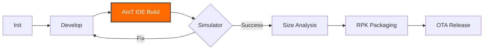

<div align="center">
  

  # IronForge 🛠️

  **High-performance development and forging toolchain exclusively for Xiaomi Vela AIoT OS.**

  **English** | [简体中文](./README.md)

  <p align="center">
    <a href="https://github.com/Rikka06/IronForge/stargazers"></a>
    <a href="https://github.com/Rikka06/IronForge/network/members"></a>
    <a href="https://iot.mi.com/vela"></a>
    <br>
    
    
    
    <br>
    <a href="https://github.com/Rikka06/IronForge/blob/main/LICENSE"></a>
    
    
  </p>
</div>

---

## 📖 Overview

**IronForge** is a professional engineering suite developed by the **Xian** organization. Designed to eliminate the pain points of wearable development—such as tight storage limits, complex build steps, and long debugging loops—IronForge integrates deeply with the official **Xiaomi AIoT IDE**. It accelerates the entire lifecycle from initialization to OTA, ensuring your Vela apps achieve industrial-grade quality.

---

## ✨ Features

### 🚀 Minimalist One-Click Init
Bootstrap production-ready Vela projects in seconds with templates following industry best practices.

### 🏗️ Official AIoT IDE Integration
No complex CLI commands required for daily tasks. Use the **Xiaomi AIoT IDE** for seamless RPK logs, breakpoints, and firmware building.

### 📊 Pixel-Perfect Size Analysis
> [!TIP]
> **Every KB matters on wearable hardware.**  
IronForge provides granular visualization of your bundle size, helping you track down bloated dependencies and compress resources specifically for the Vela runtime.

### 💻 Enhanced Local Simulation
Simulate touch interactions, sensor inputs (accelerometer, heart rate, etc.), and custom exception handling before testing on real hardware.

### 📦 Industrial-Grade Pipeline
A fully automated workflow: **Sign → Build → Verify → Package**. Includes built-in delta comparison for optimized OTA distribution.

---

## 🛠️ Workflow



---

## ⚡ Quick Start

### Via Xiaomi AIoT IDE (Recommended)

1. **Clone the Repo**:
   ```bash
   git clone https://github.com/Rikka06/IronForge.git
   ```
2. **Import**: Launch **Xiaomi AIoT IDE**, select `Open Project` and choose the `IronForge` root directory.
3. **Build**: Click the **Build** button in the top toolbar to target Vela OS.
4. **Run**: Start the **Simulator** and hit **Run** to debug your application instantly.

### Via CLI Toolchain

```bash
# Install the toolkit globally
npm install -g @xian/ironforge-toolkit

# Initialize a new app
ironforge init my-vela-app
```

---

## 📂 Directory Structure

<details>
<summary>Click to expand full project tree</summary>

```text
IronForge/
├── src/                # Core: UX layouts, logic, and assets
│   ├── pages/          # App pages
│   └── common/         # Utility classes and components
├── build/              # Custom Vela build scripts
├── dist/               # Production RPK and binary outputs
├── sign/               # Certs and signing security center
├── node_modules/       # Node.js dependencies
├── .prettierrc.js      # 2026 linting & formatting standards
├── package.json        # Main configuration
└── README.md           # Project documentation
```
</details>

---

## 🖼️ Visual Suggestions (Screenshots)

*Enhance your repository's appeal by uploading these screenshots:*
1. **[Hero_UI]**：The successful compilation interface within the AIoT IDE.
2. **[Size_Analysis]**：Visualized bundle size charts.
3. **[Simulator]**：Your app running on the circular smartwatch simulator.
4. **[OTA_Status]**：Console output showing successful OTA signature generation.

---

## 🤝 Contributing

We welcome contributions from the community:
1. **Fork** the project.
2. Create your Feature Branch (`git checkout -b feat/YourFeature`).
3. Commit your Changes (`git commit -m 'feat: add amazing feature'`).
4. Push to GitHub (`git push origin feat/YourFeature`).
5. Open a **Pull Request**.

---

## 📜 License

Distributed under the **MIT** License. See [LICENSE](LICENSE) for more information.

---

<div align="center">
  <h3>✨ Give it a Star if this tool helped you! ✨</h3>
  <p>Join <a href="https://iot.mi.com/vela">Vela Community</a> | Follow <a href="https://github.com/Rikka06">Xian Org</a></p>
</div>
