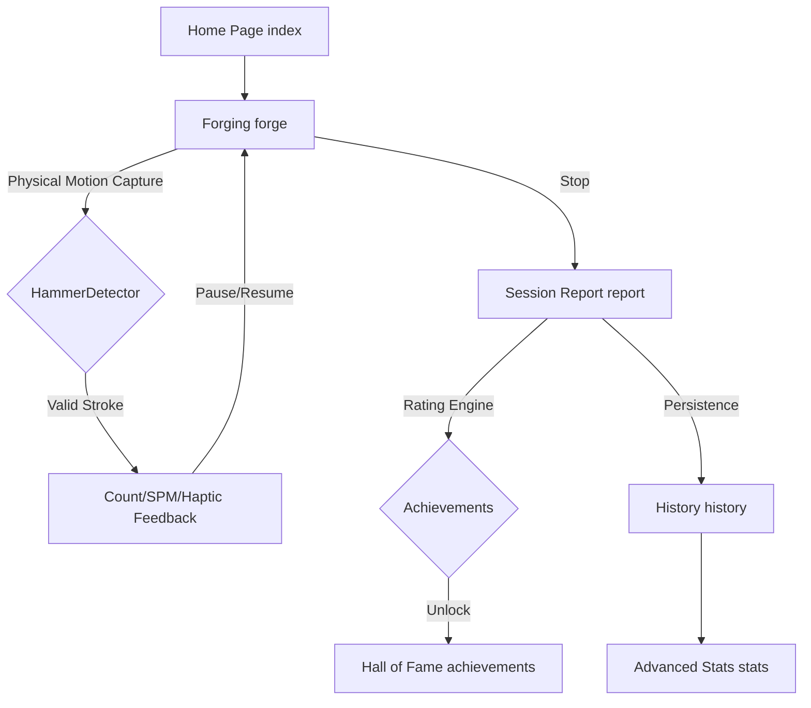

<div align="center">
  

  # IronForge ⚒️

  **Digital Forging Simulator for Xiaomi Vela Smartwatches.**  
  *Turn your wrist movements into legendary craftsmanship.*

  **English** | [简体中文](./README.md)

  <p align="center">
    <a href="https://github.com/Rikka06/IronForge/stargazers"></a>
    <a href="https://github.com/Rikka06/IronForge/network/members"></a>
    <a href="https://iot.mi.com/vela"></a>
    <br>
    
    
    
    <br>
    <a href="https://github.com/Rikka06/IronForge/blob/main/LICENSE"></a>
    
    
  </p>
</div>

---

## 📖 Overview

**IronForge** is an immersive workout and motion simulation app designed exclusively for **Xiaomi Vela** smartwatches. It isn't just a counter; it's a "Digital Forging" experience that uses the built-in **3-axis accelerometer** to capture your wrist's reciprocating motions with high precision.

Whether you're doing bicep curls or just having fun during a break, IronForge tracks every "hammer stroke," providing professional-grade analytics and hidden milestones to reward your dedication.

---

## ✨ Features

### 🚀 Retro-Industrial UI
Optimized for OLED watch faces with a high-contrast dark theme. Start your forging session with a single tap.

### 🧠 HammerDetector Algorithm
> [!IMPORTANT]
> **No phantom counts.**  
Uses an adaptive "Mean Crossing Detection" algorithm that isolates valid strokes and filters out ambient noise from walking or minor vibrations.

### 📊 Multi-Dimensional Ratings (SSS ~ D)
Get a professional grade for your "craftsmanship" after every session based on:
- **Forge Purity** (Duration)
- **Hammer Velocity** (Peak SPM)
- **Precision Control** (Tempo Stability)
- **Total Output** (Cumulative Count)

### 🏆 15 Hidden Achievements
Progress from a "Shop Apprentice" to a legendary "Millennium Forge Master." Achievements are hidden across 5 rarity levels—some require high intensity, while others demand "Zen-like" patience.

### 📈 Detailed Statistics
Stay informed with weekly and monthly reports. Analyze your intensity distribution through visualized histograms and get fun, personalized performance reviews.

---

## 🛠️ Application Workflow



---

## ⚡ Quick Start

### Via Xiaomi AIoT IDE (Recommended)

1. **Clone**:
   ```bash
   git clone https://github.com/Rikka06/IronForge.git
   ```
2. **Import**: Launch **Xiaomi AIoT IDE**, click `Open Project`, and select the `IronForge` root directory.
3. **Deploy**:
   - Click **Build** to generate the RPK package.
   - Connect your watch or open the simulator, then click **Run** to install.

### Manual Setup

```bash
# Install toolkit globally
npm install -g @xian/ironforge-toolkit
# Install dependencies
npm install
```

---

## 📂 Directory Structure

<details>
<summary>Click to expand project tree</summary>

```text
IronForge/
├── src/
│   ├── manifest.json           # Permissions & Routing
│   ├── pages/                  # UX Pages (index, forge, report, stats...)
│   └── common/
│       ├── utils.js            # Engine: HammerDetector & Rating logic
│       └── logo.png            # App Icon
├── dist/                       # Build outputs (.rpk)
├── sign/                       # Production certs
├── package.json                # Dependencies
└── README_OLD.md               # Original dev documentation
```
</details>

---

## 🤝 Community

Connect with us:
- **Developer**: Xian
- **Platform**: [Vela Developer Community](https://iot.mi.com/vela)

---

## 📜 License

Distributed under the **MIT** License. See [LICENSE](LICENSE) for more information.

---

<div align="center">
  <h3>✨ Give it a Star if you enjoyed forging! ✨</h3>
</div>
